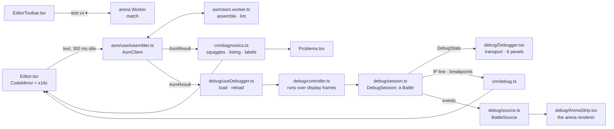

# @asmbots/web

The ASM BOTS web app: Vite 6, React 19, TanStack Router (file routes under `src/routes/`) and
Query, Zustand, and the `@asmbots/ui` kit.

| Script | What it does |
| --- | --- |
| `bun run --filter @asmbots/web dev` | Dev server on http://localhost:5173 |
| `bun run --filter @asmbots/web build` | `tsc -b`, then `build:vite`: the production build in `dist/`, then the docs for agents (see "Docs for agents") |
| `bun run --filter @asmbots/web preview` | Serves `dist/` on http://localhost:4173 |
| `bun run --filter @asmbots/web test` | Unit and component tests (`test/`), the arena Worker in Bun's real `Worker` |
| `bun run --filter @asmbots/web e2e` | Playwright (`e2e/`) against the build and the seeded e2e Worker: see "End to end" |

## Docs

`/docs` pages are MDX in `src/docs/`: a page at slug `machine/memory` is `machine/memory.mdx`,
listed in the sidebar tree `src/docs/nav.ts` (a test holds every file to a page). MDX compiles
with GitHub tables and fenced-block meta (`src/docs/remark.ts`). A page uses these blocks with no
import (`src/docs/components.tsx`):

| Block | What it draws |
| --- | --- |
| ```` ```asm run="vs=imp" ```` or `<Asm run="vs=imp">` | x16c in the editor's colors, `copy`, `open in editor`, and with `run`, `open in arena` against that roster bot, or a melee against several (`vs=dwarf,stone,paper`, up to 15); `seed=7` fixes the seed. `fragment` marks a piece of a bot: copy only |
| `<Encoding form="mov r/m16, imm16" />` | A form's bytes from `docs/opcodes.json`: opcode, ModR/M, displacement, immediate |
| `<Flags op="add" />`, `<Flags set="CZ" />` | The ODITSZAPC row, changed flags lit |
| `<Keys>g a</Keys>`, `<Keys>ctrl+enter</Keys>` | Keycaps: a chord, a combination |
| `<Note>`, `<Warn>` | Callouts |
| `<Fig src="modrm" alt="…">caption</Fig>` | An SVG of `src/docs/figures/`, drawn inline in theme colors |
| `<KeyMap />` | Every key of the app, from the key tables of `src/app/keymaps.ts` |

A code block's colors and links load once the page has painted and gone idle
(`src/docs/asm-runtime.ts`: the CM tokenizer and the share codec; `usePaintedAndIdle` in
`src/app/paint.ts`, which the site's art and footer also wait on). In a block, comments are `--text-muted`,
not the editor's `--text-dim`: in the docs they are prose. Links in prose are underlined, not
only accent-colored. The sidebar's search (`/`) reads a prebuilt index of every page's
headings and prose, `src/docs/generated/search-index.json`: run `bun run docs-index` after
editing a page (`test/docs-index.test.ts` fails on a stale index). `test/docs.test.tsx` compiles
and draws every page, and assembles every `open in editor` snippet with zero errors.
`test/docs-machine.test.ts`, `test/docs-strategy.test.ts`, and `test/docs-guide.test.ts` run
what the pages claim: every record table is fought again, every roster bot on a page must be the
roster's file word for word, and each "try" edit is made and measured. Change a bot, the engine,
or a page, and they say which words no longer hold.

`bun run docs-links` (in `bun run check`) checks every link of every page: a `/docs/…` path is a
page of `nav.ts` and its `#anchor` one of its headings, any other path a route of
`routeTree.gen.ts`, an outside link `https://` (not fetched), no relative paths, and each `Fig`
and `Shot` a real file. It prints `file:line: why` per broken link. A link to a file of the docs
for agents (below, listed in `src/docs/agent-files.ts`) passes, and loads as a file, not a route.

### Docs for agents

`build:vite` runs `scripts/agent-docs.ts` after Vite, which writes into `dist/` from the same MDX
(`bun scripts/agent-docs.ts [dist]` runs it alone on a build):

| File | What it holds |
| --- | --- |
| `llms.txt` | The [llmstxt.org](https://llmstxt.org) index: a summary, the key rules, a link to every page's `.md` by section, and the agents' files |
| `llms-full.txt` | Every page in reading order, each under its `#` heading and URL |
| `docs/<slug>.md` | One page as Markdown: `Note`/`Warn` as quotes, `Flags`, `Encoding`, and `KeyMap` as tables of their data, `Fig` as its description, `Shot` as an image, `Keys` as code, no fence meta, and site links to `https://asmbots.io/docs/<slug>.md` |
| `skill/SKILL.md` | The agent skill's instructions: `skill/SKILL.md` here, with the references and examples lists filled in |
| `skill/asm-bots.zip` | The skill folder `asm-bots/`: `SKILL.md`, `references/` (every page, links as sibling files), `examples/` (the roster's six families), and `bin/asmbots.js` (the CLI's `bundle`, for Node). Entries sorted, one fixed time: the same files make the same bytes |

A component with no Markdown form fails the build (add it to `toMarkdown`). `public/_headers`
gives these files `Access-Control-Allow-Origin: *` and an hour's cache, and `run_worker_first` in
`apps/api/wrangler.jsonc` leaves them to the static assets, which type `.md` as `text/markdown`
and `.txt` as `text/plain`. `test/agent-docs.test.ts` converts every page without a build.

## Arena

The arena lives in `src/features/arena/`: `worker/protocol.ts` has the Worker's messages,
`worker/session.ts` the battle and its keyframes, `worker/frames.ts` the frames of a battle (the
sink that gathers its events, and the builder the debugger's arena strip shares), and
`worker/client.ts` the `ArenaClient` and the `useArena` store. `ArenaCanvas.tsx` draws a client's frames: `render/scene.ts` keeps the core
mirror and the glows, `render/gl.ts` and `render/shaders.ts` draw it with WebGL2 (bloom,
scanlines, and vignette from `render/post.ts`), `render/canvas2d.ts` is the 2D fallback,
`render/camera.ts` zooms and pans, and `render/overlay.ts` draws the rulers.

### Routes

`/arena` is `ArenaPage.tsx`: `ArenaSetup.tsx` until the fight button, then `ArenaBattle.tsx`. The
URL holds the setup, `?b=roster:dwarf,local:<id>&seed=42&cycles=100000&rounds=3&procs=64&spacing=1024`
(`setup/url.ts`; no `seed` is a random seed each battle; `&w=middleweight` holds the arena to one
weight class, none takes any size), and a share link carries the same query (`@asmbots/protocol`'s
`encodeShare`) and its local bots' sources in `#src=` (deflated JSON, base64url).
`setup/search.ts`, the route's `validateSearch`, imports no code, since it rides the entry chunk.
`setup/config.ts` has the limits, the presets, and the class (`ArenaConfig.weight`, which no preset
sets), and `setup/bots.ts` the roster, the local and shared bots, the bots outside the class
(`outsideWeight`), and the fight button's words. Click-only parts load as their own chunks, since
the setup sits at the edge of its budget: the paste box (`setup/PasteBox.tsx`), dropped files
(`setup/files.ts`, with the assembler), and the problem modal with the assembler's errors
(`setup/Problems.tsx`, `setup/Diagnostics.tsx`).

The class, when set, locks the picker's weight filter (its pills count the search's bots in each
class) and random fill to it; `add` refuses a bot of another class with a warn toast (a dropped
file is still saved to my bots); choosing a class removes the picked bots of the others; and
`fightStatus` blocks a fight with one (`remove 1 bot outside middleweight`). The bots panel shows
each ready bot's class chip, and `clear` empties it, with `undo` on the toast. `vite.config.ts` loads the roster's `.asm` imports as text (`textImport` of the repo's
`scripts/text-import.ts`, which also reads the docs' figures; the API's Vitest pool uses it too).

`ArenaBattle.tsx` is the battle, its parts in `battle/`: `Hud.tsx` (a band over the core that the
camera keeps clear), `Transport.tsx` (the scrub bar marks keyframes and bot deaths), the rail's
`BotsPanel.tsx`, `EventsPanel.tsx`, and `StandingsPanel.tsx`, `Victory.tsx`, the hover tooltip
`HoverTip.tsx`, and the keys (`space . , [ ] 0 1-9 f s m`) in `keys.ts`. `log.ts` turns the Worker's
messages into the round's timeline, `view.ts` holds what the player picked (isolated bots, the
minimap, autoplay), `screenshot.ts` and `replay.ts` write the PNG and the `.asmreplay.json`. A load
is a match: the Worker plays round i with `@asmbots/tourney`'s `roundOrder` and `roundSeed` and
scores it with `withRound`, so the arena's match equals `runMatch`'s. Frames name bots by their
place in the load, whatever order a round fights them in.

`/arena/$replayId` is `ReplayPage.tsx`: a replay in the same battle view. The victory's
`replay link` copies `/arena/<match key>#r=<base64url of the replay's JSON>`: `@asmbots/protocol`'s
`Replay` (the `download replay` file), with the bots' bytes and SHA-256 but not their sources.
`battle/replay.ts` still reads the arena's older `asmbots-replay-local/1` files and links. The page loads it into the Worker and plays at once.
`battle/verify.ts` checks each bot's SHA-256, then that the Worker's match key (`matchHash` of the
replay's inputs) is the recorded one, then each round's result hash as the round ends. The chip
beside the arena's title says `verifying`, `verified 1/3`, `verified` in accent, or `mismatch` in
danger with the reason in its title and on the victory. A link is held to what the arena runs (2
to 16 bots, 10 rounds, 1M cycles, 256 processes a bot) before anything loads. On a replay, `share ▾`
copies its link, `download replay` saves it as it came, and `setup` goes to `/arena`. A link with
no `#r=` loads the replay from the API (`GET /api/replays/:key`).

The boot screen and the welcome tour live in `src/app/boot/`. `main.tsx` calls `armBoot()` before
the first render: the page boots when it loads at `/`, once a session (`sessionStorage`), and not
when `navigator.webdriver` is set, so Playwright and Lighthouse see `/` as before; `?boot=1`
forces it (`e2e/boot.spec.ts`, the a11y spec). `core-dump.ts` is the backdrop: a seeded model of a
core that zeroes, loads four bots, and runs them, drawn on a 2D canvas one changed cell at a time;
under reduced motion it is a still. The tour
(`WelcomeTour.tsx`, its own chunk) ends on `/arena?intro=true`.

The home page's hero is `demo/HomeDemo.tsx`, driven by `demo/demo.ts`: Spiral and LCG painters,
Dwarf, and Paper in the duel config, 400 cycles a frame, a new random seed that places them each
battle, and 3 s on each battle's end before the next. `DemoLoop` pauses the battle while the tab
is hidden or the hero is off screen. `ArenaCanvas` draws it with `interactive={false}`: a
`role="img"` picture with no HUD, minimap, hover, or keys, which the wheel scrolls past. Bloom
follows the settings, on by default. Under reduced motion the hero is a still: battle 62 at
cycle 24,000, all four bots alive, painted by the 2D renderer's `CorePainter` onto a 256 x 256
canvas. `HomePage.tsx` loads the demo after the page's first contentful paint and an idle moment,
so its 65 KB gz (the renderer, the roster, the engine, and the Worker) costs `/` nothing in
Lighthouse. The demo makes no sound.

### Sound

`src/features/sound/engine.ts` synthesizes DESIGN_SYSTEM §7's cues with WebAudio, no samples: a
tick, a write click (band-passed noise), a process death's thud, a bot death's falling tone (from a
pentatonic step per hue), the victory (root, fifth, octave), and the transport's click. Sound is
off until `m` in a battle, the HUD's sound button, or `/settings` (master volume, one switch per
cue) turns it on. No AudioContext exists before the page's first gesture (`keydown` but `esc`,
`mousedown`, a touch's `pointerup`), so a replay that plays at load stays silent until one. The
budget: 12 cues in any second; tick, write, and death at most every 125 ms and 8 a second; clicks
10; bot deaths and the victory the rest. Writes coalesce into one click per 250 ms, as loud as the
writes it stands for. `sound/arena.ts`'s `useArenaSound` plays a battle's cues in `ArenaBattle`
(`/arena` and replays); full frames (a load, a seek) are silent. The 404 page's imp, the live panel,
and a tournament's watch modal play by themselves and stay silent. The synth builds as a small
chunk of its own (`engine-*.js`, named after its file); a `manualChunks` rule for it would pull
the kit out of the entry. Tests: `test/sound.test.ts` on `test/fake-audio.ts`, and
`e2e/sound.spec.ts`, which takes away the user activation Playwright's `goto` gives a page.

### First visit and the intro

A first visit to `/arena` gets a three-step tour (PRODUCT_SPEC §9, `tour.tsx`), one kit `CoachMark`
at a time: `1/3` under the first roster card's `+` until two bots are picked, `2/3` over the fight
button, `3/3` in the events log once the battle shows (`placement="inline"`, so the newest lines
stay in view). Doing a step moves the tour on. `skip the tour` or `got it` puts it away for good,
as does `setup` from the battle it ends on (`coachMarksSeen` holds `arena`, beside the editor's
`editor`).

The header's `intro` links to `/arena?intro=true`: `ArenaPage` loads Dwarf vs Imp at seed 263
(`intro.tsx`; Dwarf's bomb lands on Imp's next word at cycle 55,602, first blood and the end),
writes that setup to the URL, and sets 200 cycles a frame. Its guide (`useIntroGuide`, three marks)
holds the placement 6 s (or until `play now`), plays, points at the events log at first blood,
then offers `pick bots` (the setup, with the intro's bots in) and `done`. About 30 s in all. The
tour stays out of the intro's battle, and picks up in the setup after it.

### Worker protocol

The Worker (`worker/arena.worker.ts`) is an `ArenaSession` behind `postMessage`. It runs cycles
only when asked, never on its own. Every typed array it sends is transferred, not copied.

| Request | Answer |
| --- | --- |
| `load { bots, config, rounds }` | `loaded`, then a full frame of round 1 at cycle 0 |
| `setRound { round }` | `loaded`, then a full frame: a round played before, or the next |
| `step { cycles }` | a frame |
| `seek { cycle }` | a full frame |
| `requestFrame` | a frame of `speed` cycles, only while playing |
| `play`, `pause`, `speed { cyclesPerFrame }` | nothing, or an `error` |
| `match { bots, config, rounds }` | `match { match }`: the whole match headless, as `runMatch` gives it, or an `error` |

- `match` (the editor's `test vs`) runs beside the battle and leaves it as it was: no frames,
  and `ArenaClient.runMatch` settles its calls in the order it sent them.
- Each request that moves the battle (`load`, `setRound`, `step`, `seek`, `requestFrame`) gets
  exactly one `frame`, or an `error` in its place. `ended { result, hash, round, match }` follows
  the frame that ends a round. A failed request leaves the battle as it was.
- A frame is what changed: written bytes as (address, byte and owner tag) pairs with each byte's
  write cycle, run bytes as (address, bot) pairs, each live process's IP (`IP_FRONT` on each bot's
  front process), the spawns, deaths (with the killer's tag), and bot deaths, and 3 stats per bot
  (processes, bytes owned, writes). A full frame (`load`, `setRound`, `seek`) carries the whole core
  and owner map instead, and every bot dead by then.
- Pacing: `ArenaClient` asks for one frame per display frame, and never while one is owed, so a
  slow or hidden tab slows the battle instead of queueing frames. A frame runs `speed` cycles
  (0.01 to 10,000, or `max`; below 1 the Worker adds up the shares and runs a cycle each time
  they pass a whole one) and stops early at 12 ms (`FRAME_BUDGET_MS`): a slow machine gets fewer
  cycles per frame, not fewer frames. A seek waits while frames are owed, and a later seek
  replaces it, so a scrub drag sends its last.
- Seeking: a keyframe `snapshot()` every 1,000 cycles, 128 at most, dropping the one farthest from
  the playhead. A seek restores the latest keyframe at or before its target and runs forward with
  the frame's events off.
- A match's round i fights the bots in `roundOrder` with `roundSeed` (ISA §5.5). The messages name
  bots by their place in the load, so a bot keeps its hue from round to round.

### Renderer passes

`render/gl.ts` draws only when something moved: a frame, a glow or ring still fading, the camera,
or a setting. Each image:

1. Uploads what changed, each texture whole, 256 x 256: the owner map (R8UI), a non-zero bitmask
   (R8UI, a bit a byte), and the write and exec ages in ms (R16UI).
2. The scene pass (`ARENA_FRAG` on one full-screen triangle): each byte its owner's hue at 0.55
   alpha, or 0.22 when the byte is zero; the exec trail `exp(-age/600)` in yellow; the write flash
   `exp(-age/220)` in white; the lattice from zoom 4. A dead bot's territory desaturates 40%;
   isolation dims the others to 20%. Then the death ripples and spawn pulses (`RING_*`, instanced,
   256 at most) and one marker per live process (`MARKER_*`, instanced). The pass writes two
   targets: the color, and the emissive light alone (trails, flashes, markers, rings).
3. Bloom: the emissive target down to quarter size (`DOWNSAMPLE_FRAG`, a 4 x 4 mean), a 9-tap
   Gaussian across and then down (`BLUR_FRAG`).
4. Composite onto the canvas (`COMPOSITE_FRAG`): the color, plus the bloom at the theme's strength,
   times the scanlines and the vignette (`render/post.ts`: paper has neither). With all three
   effects off, the scene pass draws straight onto the canvas.
5. Zoomed in, the minimap: the owner map again, small, with the view's outline.

The rulers and the hover crosshair are a 2D canvas over it (`render/overlay.ts`). Where WebGL2 is
missing, `render/canvas2d.ts` paints the core on the CPU (`CorePainter`, repainting only the
bytes that changed or still glow) and draws it scaled, with the same colors and no post effects.

### Performance

Measured on an M5 Max in headless Chromium 1243, 2026-09-23.

| What | Where | Result |
| --- | --- | --- |
| `ArenaSession`, 16 roster bots, 2,000 cycles a frame | Bun | p50 1.1 ms, p95 2.8 ms a frame; seeks 0.2 to 6 ms |
| `e2e/arena-perf.spec.ts`, 16 bots, 2,000 cycles a frame, all effects | 1280 x 720, DPR 1 | p50 16.7 ms, p95 16.8 ms frame gap |
| The battle page, same melee (HUD, rail, sparklines, log) | 1280 x 720 DPR 1, 1440 x 900 DPR 2 on Metal | p95 16.7 ms, no long tasks |
| The home demo, 4 bots, 400 cycles a frame, bloom | 1280 x 720 DPR 1, 1440 x 900 DPR 2 on Metal | p95 16.7 ms, max 16.8 ms |
| Cold JS | every page | "Budgets" below: `bun run bundle` measures it at each `bun run check` |

Headless Chromium's WebGL is SwiftShader (software) unless launched with `--use-angle=metal`. It
holds 60 fps at DPR 1; at DPR 2 with bloom the melee's p95 is 33 ms. The renderer's first images
under SwiftShader make one long task of about 120 ms (half with the post effects off), which
the home page moves past its first paint.

The renderer's Playwright specs drive `e2e/harness/arena.html`, a page only the dev server serves.
`e2e/arena-perf.spec.ts` (16 roster bots at 2,000 cycles a frame: the arena alone, then the
production build's battle page) and `e2e/arena-soak.spec.ts` (10 minutes, opt-in) are the `perf`
project, which runs after the rest, on Metal on a Mac: `bunx playwright test --project perf
--no-deps` runs them alone. Their budgets are in "Budgets".

### Adding an effect

1. State: keep it in `render/scene.ts`. Take its data from the frames in `applyFrame` (or add a
   field to the frame in `worker/protocol.ts` and `worker/frames.ts`), move it along in `advance`,
   bump a `*Version` counter when it changes, and push the matching `…Until` time out while it
   still moves, so `advance` reports the image as changed until it is done.
2. Draw it in both renderers. WebGL2: a uniform or texture that `ARENA_FRAG` reads, or an
   instanced pass like `RING_*`, in `render/shaders.ts`, with its upload in `render/gl.ts`. Light
   that should bloom goes to the emissive target too. 2D: `CorePainter.paintCell`, or a draw over
   the core in `render/canvas2d.ts`.
3. A post effect: its strength per theme in `THEME_POST` (`render/post.ts`), a switch in
   `ArenaEffects` (`store/settings.ts`, `sanitizeSettings`, and the settings page), and its math
   in `COMPOSITE_FRAG`.
4. Motion: under reduced motion (`scene.reducedMotion`) an effect that moves must not, as the rings
   do not.
5. Tests: the state in `test/arena-scene.test.ts`, the 2D pixels in `test/arena-canvas2d.test.ts`,
   the WebGL pixels in `e2e/arena-render.spec.ts`, and then `e2e/arena-perf.spec.ts` alone.

## Editor and debugger

`/editor` is a new bot; `/editor/<id>` a bot of this browser; `/editor/roster-<slug>` a roster
bot, read-only, with `fork`. `/editor?b=…` (the arena's `open in debugger`) opens the setup's first
bot, `/editor#src=…` (the editor's `share`) opens a bot not saved yet, and `/editor?t=dwarf` starts a
new bot from a template. The code is in `src/features/editor/`; `EditorRoutes.tsx` turns the URL
into a document, and `EditorPage.tsx` (its `Workbench`) lays the page out and owns every action.

### Architecture

Two Workers and one main-thread battle. The assembler Worker turns the text into bytes; the
debugger runs its own `Battle` on the main thread, so a step stops between any two cycles; the
arena Worker plays `test vs` headless.



| Part | Where |
| --- | --- |
| Assemble on idle | `asm/useAssembler.ts` sends the source to `asm/asm.worker.ts` 300 ms after the last change (the first at once); only the answer to the last request counts. `asm/run.ts` assembles at the 4,096-byte cap (the top of super-heavy), lints, and measures a bot past the cap. `asm/client.ts` falls back to the main thread if the Worker fails. |
| Results in the editor | `cm/diagnostics.ts`: `showResult` hands a result whose source the editor still holds to `@codemirror/lint` (`setDiagnostics`: squiggles, tooltips with the fix, `lintGutter` marks) and to `setAssembled`. `problemsOf` reads the mapped findings back for `Problems.tsx`. |
| Listing gutter | `cm/listing.ts`: `0x000D  C7 05 00 00` per line from the last assemble without errors, mapped through edits until the next; `l` shows and hides it. |
| Toolbar | `EditorToolbar.tsx`: name, `%name`, size (warn from 90%, danger past the cap), assemble (Mod-Enter), format (Shift-Alt-f; `diff.ts` turns the formatter's text into small changes so the cursor stays in its token), lint, save (Mod-s), versions, share, `test vs ▾`, templates, listing. |
| New bot | `EmptyEditor.tsx`: while `/editor` holds the blank template as it comes, or no text, the templates sit over the editor, under the blank bot's lines. A template starts the bot from it (`?t=`, one edit that undo takes back); `blank` keeps the blank bot and selects its name; typing or `close` puts the panel away. |
| First visit | The kit's `CoachMark` under the debugger's run button: "assemble runs as you type; press F5 to debug". It goes for good on `got it` or on the debugger's first move (`useCoachMark('editor')`, `coachMarksSeen` in `store/settings.ts`). |
| Storage | Local bots in IndexedDB (`store/local-bots.ts`), the last 20 saves of each in their own database (`store/bot-versions.ts`); the switches, the recent list, and each unsaved text (a draft) in `localStorage` (`store.ts`). |
| `test vs ▾` | `test-vs.ts`: ten rounds of the duel against a roster bot in the arena Worker (`match`), shown as `W 7 · T 2 · L 1 vs imp`; `watch` opens `/arena` with the same bots and seed. |
| Debugger core | `debug/session.ts`: `DebugSession` runs a `Battle` on the main thread, a cycle at a time: step (one instruction of the followed process), step over (`call`, REP), step out, run to cursor, run until death, run N, and step back through the last 256 snapshots (a cycle at a time through a run). Each process's last 200 instructions (`debug/trace.ts`), register edits, and runs in parts (a budget of cycles) are the session's too. |
| Debugger page | `debug/useDebugger.ts` loads the editor's last assemble without errors with the opponents and seed (`?b=…&seed=…` start them), again by itself until the session moves, then on `reload`, carrying breakpoints by line (`debug/load.ts`). `debug/controller.ts` runs over display frames (8 ms of each, or the speed) and shows a run 10 times a second. |
| Debugger panels | `debug/Debugger.tsx`: the load bar, the transport, and Registers, Processes, Memory (`debug/memory.ts`: 32 rows swept from the listings' known starts), Watch, Breakpoints, and Trace (the CLI's trace format). `cm/debug.ts` puts the IP line and the breakpoint gutter in the editor. |
| Arena strip | `debug/ArenaStrip.tsx`: the arena's renderer on `debug/source.ts`, a `BattleSource` that taps the session's events with the arena Worker's frame builder (no Worker), locked on the followed IP; it folds with the kit's `SplitPane` (`collapsed`). |

The bot library (`Library.tsx`, `b`) lists recent documents, my bots, and the roster.

### Keymap

The function keys go through one window listener (`debug/keys.ts`): they work in the editor and in
the panels' fields, and never reach the browser, where F5 reloads and F11 goes full screen. The
page keys are the app's keymap: a text field keeps them while it has the focus, and Esc leaves the
editor (a popup or the search panel closes first). `?` lists them all. Every key's words live in
`src/app/keymaps.ts`, which the hooks, the key help, and the docs' keyboard map all read.

| Key | Where | Does |
| --- | --- | --- |
| Mod-Enter | editor | assemble now |
| Shift-Alt-f | editor | format |
| F8 | editor | go to the next problem |
| Tab, Shift-Tab | editor | the next 8-column stop; one stop out |
| Ctrl-Space | editor | completion (CodeMirror's keys: search, undo, and the rest, work too) |
| Esc | editor | leave the editor |
| Mod-s | anywhere | save |
| F5, F6 | anywhere | run, pause |
| F9 | anywhere | set or clear the breakpoint on the cursor's line |
| F10, F11, Shift+F11 | anywhere | step over, step, step out |
| `space` | page | run or pause |
| `.`, `,` | page | step, step back |
| `[`, `]` | page | slower, faster runs |
| `0` | page | the strip's whole core |
| `b`, `l` | page | the bot library, the listing gutter |

### Breakpoints

A breakpoint is an address in the `DebugSession`, never an INT3 in the core. Before each cycle the
session reads the front process of each living bot, the one that runs in that cycle, and stops
when one stands on an enabled breakpoint whose condition holds (`check` in `debug/session.ts`). No
turn can change another bot's queue or registers before its own turn, so the check before the
cycle is exact. The core stays as the arena has it: an opponent can neither read a breakpoint nor
bomb it, and the debugger's battle is the arena's, cycle for cycle.

- **Setting one.** A press on the gutter left of the line numbers, F9 on the cursor's line, a press
  on a memory row, or an address or a label in the Breakpoints panel.
- **Lines and addresses.** Each line with bytes carries a marker from the loaded bot's listing
  (`cm/debug.ts`): the line's offset plus the bot's base, which the seed moves. The markers map
  through edits, so a line keeps its address until the next load, and a line typed since has none.
  A `reload` moves each breakpoint in the bot's bytes to its line's new address (`debug/load.ts`);
  one elsewhere in the core keeps its address.
- **Conditions.** `ax == 0x10 && cx < 3`, typed in the Breakpoints panel. `@asmbots/asm`'s
  `parseCondition` reads each side as the assembler reads an expression (number forms, operators,
  precedence) over the registers, their byte halves, `ip`, `flags`, and `cf pf af zf sf tf if df of`;
  `$` is the IP. Values wrap to 16 bits and compare unsigned. A condition that cannot be evaluated
  (a division by zero) stops the move and says why.
- **Hits.** Each breakpoint that holds before a cycle counts a hit; when two hold in the same cycle,
  the first in turn order is the stop. `reset` keeps the breakpoints and zeroes their hits.
- **Resuming.** A move never stops where it starts: `run` from a breakpoint runs the instruction
  there first, as a debugger resumes.
- **INT3.** ISA §3.6 makes INT3 a breakpoint in the debugger: the session stops before a process
  runs an INT3 its own bot owns, and the next move runs it, so the process dies as in the arena. An
  INT3 another bot wrote is a bomb, and kills without a stop.

### Adding a template

1. Write its source in `templates.ts` as a constant, in the formatter's layout, with `%name`,
   `%author`, and `%strategy`. A roster bot needs no copy: `templateSource` takes it from
   `rosterCatalog()`, as `imp` and `dwarf` do.
2. Add its id to `TEMPLATE_IDS` (lowercase letters: `?t=` takes `[a-z]{1,32}`), its entry to
   `TEMPLATES` (`label`, the menu's text; `detail`, the empty state's second column, 28 characters
   at most), and its case to `templateSource`.
3. The toolbar's templates menu, the new bot's empty state, and `/editor?t=<id>` pick it up.
4. Test: `test/editor-docs.test.ts` assembles every template (no error, no lint warning), checks
   that the formatter leaves it as it is and that its detail fits; add its label to that test's
   list and to the empty state's in `test/editor-page.test.tsx`.

A snippet that goes in at the cursor, such as the base idiom, is not a template: it is an entry of
`SNIPPETS` in `cm/complete.ts`, which completion and the menu's `base idiom` share.

## Tournaments

Local tournaments (PRODUCT_SPEC §4) run in this browser: the arena Worker plays the matches,
headless, and `@asmbots/tourney` schedules and scores them. The code is in
`src/features/tournaments/`. EXEC 3.3 adds server-run tournaments on the same views.

| File | What it holds |
| --- | --- |
| `store.ts` | The `Tournament` record in IndexedDB (`asmbots-tournaments`), its query hooks. A local bot's source is copied in, so a later edit changes nothing. |
| `runner.ts` | `tournamentRunner()`, the page's runner: `iterateRoundRobin`, `iterateBracket`, or a melee a round at a time, saved after every match. `start`, `pause`, `cancel`; `useRunnerSync()` keeps the query cache current and resumes what a reload left `running`. |
| `create.ts`, `NewTournament.tsx` | The new tournament form: entrant limits (bracket 3..32, melee 2..16, round robin 2..32), the match count and time estimate, the fixed seed. |
| `TournamentsPage.tsx`, `TournamentTile.tsx` | `/tournaments`: tiles of one height (a glyph of the kind, a stripe of the status's color, the champion, the live match count or the entry window, a bar of the matches played), kind and status filters, search. |
| `TournamentPage.tsx`, `TournamentHeader.tsx` | `/tournaments/$id`: the header (name, kind, status, controls, `share`, entrants with the champion in accent) over the view of the kind. |
| `BracketView.tsx`, `RoundRobinView.tsx`, `MeleeView.tsx` | The views: `BracketSvg` (the CLI's `bracketSvg`, themed), `ResultsMatrix` and `StandingsTable`, the melee's survival histograms. Each has its `MatchPanel`. |
| `TournamentControls.tsx` | The status chip, `start` / `pause` / `resume` / `cancel`, and `auto-watch`. |
| `watch.ts`, `WatchModal.tsx` | A round rebuilt from its inputs and played in the arena; a recorded round checks its result hash. |
| `export.ts` | `results.json`, `bracket.svg`, `standings.csv`. |
| `share.ts` | Tournament links. |

A tournament on the page is this browser's by that id. When there is none, the page reads the
link's fragment. `share` copies `/tournaments/<id>#t=<base64url of the deflated JSON>`, schema
`asmbots-tournament-link/1`: the name, kind, status, config (written out in full), rounds, a
bracket's seeding and third-place flag, the entrants, and every match played. A roster bot travels
as its slug; a local bot as its machine code in base64url, up to 4,096 B (`MAX_BOT_BYTES`, so every
bot that assembles), and so its rounds can be watched from the link. The page rebuilds the
bracket, standings, progress, and champion from the matches with `@asmbots/tourney`, and rejects a
link whose matches do not fit its entrants (`this tournament link is broken: …`). A shared
tournament is read only: it has no controls, nothing stores it, and one shared while running reads
`paused`.

Tests: `test/tournaments-*.test.ts(x)` (store and runner, form, list, bracket, views, share and
detail page) and `e2e/tournaments.spec.ts` (a bracket and a round robin to the end, and the round
robin's link opened in a fresh browser).

## Stats

`/stats` (PRODUCT_SPEC §12) is the site in numbers, from one read, `GET /api/stats`, at most
5 minutes old. The code is in `src/features/stats/`.

| File | What it holds |
| --- | --- |
| `query.ts` | `statsQuery`, `useStats`. Not in `api/queries.ts`: every page takes that module, and only this one reads the stats. |
| `series.ts` | Every day from the first to today (at least 30, at most 90 on the chart), running totals, uptime (`3d 04h`), the bots by class and by size in powers of two, `compact` (`142M`). |
| `charts.tsx` | `DayChart` (a bar a day, the hovered or today's bright, its readout above), `SizeChart` (the size histogram, the classes under the bins they span), `ClassCounts`, `Split` (two counts as one bar). HTML boxes in the theme's tokens, no chart library; each chart is one image to assistive tech, its label the numbers. |
| `StatsPage.tsx` | The panels: the site in numbers, activity, life and death, weight classes, records, hills. |

The banner is the `chart` plate (DESIGN_SYSTEM §10). The footer's `compete` column links the page.

Tests: `test/stats.test.tsx` (the series, the page, a failed read), API `test/stats.test.ts`; the
page is in the smoke, axe, and focus specs.

## Empty and error states

Every list says when it is empty with the kit's `EmptyState` (DESIGN_SYSTEM §4, §9): one muted
sentence and one accent action. A link action goes through `app/link-action.ts`
(`useLinkAction`), a real `href` the router takes over on a plain click.

| List | It says | Its action |
| --- | --- | --- |
| Hills (`/hills`, `/stats`) | no hill is open yet. | see how hills work (`/docs/tournaments/hills`) |
| A hill's standings, its feed; the home page's top 10 | no entrants yet. / no submissions yet | submit a bot: the hill's own `submit` dialog, `sign in to submit a bot` signed out; the home page links `/hills/main` |
| Matches (hill, home) | no matches played yet. | fight one in the arena |
| Tournaments | no tournaments yet (this browser, the server) / no tournament matches. | new tournament / clear the filters |
| My bots: arena, library, profile, submit and enter dialogs | none saved in this browser yet. / no bots in your account yet | write a bot, save this bot, write a new bot, open the editor |
| Roster and my bots, searched | no roster bot matches "x". | clear the search |
| Versions (the editor's `versions`, open for any bot that can be saved) | no saves yet | save now |
| Watch | nothing watched yet | watch ip |
| Breakpoints | no breakpoints yet | break on the cursor's line (F9's work) |
| Events | no events yet. (every filter keeps the round's first line, so only a round not loaded) | play |
| A bot's hill placements; a profile's hills and championships | not on any hill yet. / on no hill yet. / no championships yet. | see the hills, see the tournaments |

A read of the API that fails draws `app/LoadFailure.tsx` in its panel: `could not load: <the
API's words>` and `retry`, which refetches. TanStack Query v5 clears the error of a read that has
no data when it fetches again, so the panel shows its loading state until the answer.

Offline (the browser's `offline` event), the status bar's left end trades `● local` for
`○ offline` and `arena, editor, and local tournaments still work`, in a live region
(`app/online.ts`), and a failed read says it will load once the network is back (TanStack
refetches on reconnect). The limit: there is no service worker, so the arena and the editor work
offline with the code the page has already loaded (the arena's Worker starts with its first fight,
the assembler's with the editor). A route never opened needs the network; TanStack's lazy routes
reload the page when a chunk does not come.

## Sharing and embeds

`share ▾` (`features/share/ShareMenu.tsx`, PRODUCT_SPEC §10) offers what a page has of three
things: `copy link`, `copy embed` (an `<iframe>` of the page's battle, 800 x 450), and `download
png` (the page's share card from the API, or the arena's screenshot). Each copy says so in a toast.

| Page | Link | Embed | PNG |
| --- | --- | --- | --- |
| A battle (`/arena`, title row and victory) | the setup's share link | the same link under `/embed` | the screenshot (`s`) |
| A replay (`/arena/$replayId`) | the stored replay's page, else its `#r=` link | `/embed/arena/<key>` (or the `#r=` link) | the screenshot |
| A bot (`/bots/$id`) | its page | once its source is known: it sparring with `dwarf`, seed 1, its source in `#src=` | its card, unless private |
| A hill (`/hills/$slug`) | its page | its newest match that has a replay | its card |
| A server tournament | its page | the match it finished last that has a replay | its card, unless a draft |
| A tournament of this browser | its `#t=` link | none | a bracket drawn in the page's theme (`export.ts`) |

The embed of an arena URL is the same URL under `/embed` (`share/share.ts`): `/embed/arena?b=…#src=…`
fights the battle an arena link names (the roster's bots and those the fragment carries; this
browser's own bots are not read, since a third-party frame has no access to them), and
`/embed/arena/$replayId` plays a replay (`features/embed/EmbedArena.tsx`). The embed routes set
`staticData.frame: false`, so the root draws no header, ticker, or status bar: the arena, a legend,
the outcome line at the end, and a bar with play/pause, restart, the round and cycle, and `watch on
asmbots`, which opens the same battle in the arena in a new tab. It plays as it loads (under
reduced motion it waits for `play`), rounds follow on after `ROUND_PAUSE_MS`, and the arena is a
picture (`interactive={false}`), so the wheel scrolls the page around it. No sound, no keys.

Crawlers and link previews (`app/pages.ts`): the build writes `meta/pages.json` (each page the
server can describe without data: the app's pages and every docs page, by the titles their routes'
`head`s write, a description, and the card's words), `sitemap.xml` (the pages search may index;
the Worker adds the hills and the public bots), and `robots.txt`, and puts the home page's head
tags in `index.html` (`sitePages` in `vite.config.ts`). The Worker swaps those tags for each page's
own (`apps/api` README, Pages and share cards). `SITE_URL` is `https://asmbots.io`, as the Worker's.

Tests: `test/share.test.tsx`, `test/embed.test.tsx` (the embed in the app's own route tree has no
header), `test/site-pages.test.ts` (the manifest's titles are the routes' `head`s), and
`e2e/embed.spec.ts` (the embed plays to its end; `copy embed` pasted into another page plays
there, framed; the Worker's heads, cards as PNGs, frame policy, sitemap, and robots).

## Details that come with age

- **Release names.** The status bar's version chip links `/docs/changelog` and names its release
  in a tooltip: `2026.10.03a · "imp gate"`, or for a build ahead of every release, the one in the
  making: `2026.09.25a · "imp gate" · unreleased` (`app/version.ts`). The names live in the root
  `CHANGELOG.md` (`## <version> · "<name>"`, `## Unreleased · "<name>"`), which
  `scripts/changelog.ts` reads at build (`__APP_RELEASE__`) and the changelog page renders: a docs
  page may name a repository Markdown file (`markdown` in `docs/nav.ts`), compiled as plain
  Markdown, indexed, and link-checked like the rest. A link to `https://asmbots.io/...` there
  (it reads on GitHub too) goes through the router like an app path. `scripts/version.ts` gives
  a commit tagged as a release (`v2026.10.03a`) that version.
- **The fps chip** turns `--warn` under 50 fps (`FPS_WARN`), and its tooltip names the speed
  slider (and `[`) as the fix. It is a Tab stop while it shows, so the keyboard reads it too.
- **Screenshots** (`s`, `download png`) end in a footer stamp: the bots (or their count when the
  names would reach the site), the seed, the cycle, and `asmbots.io` (`SITE_HOST`, whatever host
  served the page).
- **The 404 page** runs the roster's imp in the arena renderer (`demo/LiveImp.tsx`, a chunk the
  shell never waits for): seed 182,052 places it at 0x0404, 2 cycles a frame, a lap of the core,
  then again; the view fits the core's columns to its width and follows the imp's row. It pauses
  out of sight, makes no sound, and stands still 400 cycles in under reduced motion.
- **`robots.txt`** opens with the imp in one line of ASCII: its loop's bytes, `A5 90`, and its
  head.
- **A bot's page** says its fights (the server's matches of any of its versions) and when it was
  first seen, with how long ago; **a hill's king card** its reign: the submissions it has held
  the top through.

`main` keeps a scroll padding (`scroll-py-2`): a Tab stop the browser scrolls into view keeps its
focus ring clear of the scrollport's edge (the Tab walk of `/hills/main` found a ring cut there).

Tests: `test/frame.test.tsx` (the version chip, its title, the fps chip), `test/screenshot.test.ts`,
`test/live-imp.test.tsx`, `test/site-pages.test.ts` (the imp's bytes are the roster imp's loop),
`test/api-pages.test.tsx`, `scripts/changelog.test.ts`, `scripts/version.test.ts`, and
`e2e/delights.spec.ts` (the tooltip and the changelog page, the imp walking in WebGL2, a real
screenshot's footer pixels, and from the Worker: uptime, fights, first seen, reign).

## Accessibility

DESIGN_SYSTEM §8. Four Playwright specs hold it, all nine themes where color matters. CI runs no
Playwright, so run them before a change to the UI ships (about 4 minutes; the Worker ones need the
e2e Worker, which `playwright.config.ts` starts):

```sh
bunx playwright test e2e/a11y.spec.ts e2e/focus.spec.ts e2e/keyboard.spec.ts e2e/motion.spec.ts --project chromium
```

| Spec | What it proves |
| --- | --- |
| `a11y.spec.ts` | axe (`@axe-core/playwright`, every rule it runs by default: WCAG 2.2 A and AA and its best practices) finds nothing on every route, every docs page, and the states users reach: a battle paused, its share menu, its victory, the key help, the theme menu, the docs search, a local round robin's form and matrix, the first sign-in, the hill's submit dialog, the settings with sound on. 6 tests a theme. |
| `focus.spec.ts` | The focus ring shows at 3:1 or more on `--panel` in every theme (pixels, not CSS: two shots of one clip, focused and not), and every Tab stop of 14 routes shows its focus (53 on `/`, 45 on `/arena`, 31 in a battle, 153 on `/editor`, 111 on `/docs`). |
| `keyboard.spec.ts` | With keys alone: load two bots and fight (the live region speaks); write a bot and debug it (F11, F9, F5); create a tournament and watch it finish; sign in, save a bot to the account (`mod+s`), and submit it to a hill. Each control is reached by Tab. |
| `motion.spec.ts` | The system's reduced motion, or the app's setting over it, stills the ticker and the coach marks; `full` over the system's reduce moves them. |

`bun run contrast` (in `bun run check`) gates the token colors themselves: every text token at
4.5:1 on the three surfaces and on the `--accent-10` fill, `--text-bright` on the `--accent-25` and
`--accent-45` fills too, and `--accent` (the ring) at 3:1.

Rules for new UI, each learned from a violation this pass fixed:

- **Text colors**: `text-text`, `text-bright`, `text-muted`, `text-accent-fg`, `text-warn`,
  `text-danger`, `text-info`. `text-accent` is not for text (it is the border and ring color; in
  pedurple it reads 4.0:1), and `text-dim` is never content (placeholders, the input's `>` glyph,
  list markers). Text on an `--accent-25` or `--accent-45` fill is `text-bright` (white is now):
  the debugger's IP row and line (`cm/debug.ts`) drop their syntax colors for it.
- **A box that truncates and holds a link or a button** uses `truncate-ring`, not `truncate`: it
  clips 2 px out, where the ring is (the kit's table cells, `Stat`'s value, the king's card). It is
  `overflow: clip`, which makes no scroll container: a flex item needs `min-w-0` as well.
- **A link in running text is underlined** (`CELL_LINK`, `EmptyState`'s action, the docs' links),
  never color alone.
- **A box that scrolls** (a `<pre>`, the source) is a Tab stop with a ring, or holds one.
- **One `<h1>` a page**: its visible title (home, a bot, a profile, a docs page), else
  `app/PageHeading.tsx`, hidden, in the route's component.
- **Landmarks**: the frame puts the ticker in an `aside`, a route's toolbar in a `section`
  (`<label> tools`), and the page in `main#content`, which the skip link (the first Tab stop)
  focuses without touching the URL's fragment. A docs callout is `role="note"`, not an `aside`.
- **Rings the page cannot cut**: the arena's is an `::after` layer over its canvases (an outline
  inside the box sat under the WebGL layer); a sticky sidebar caps its height to the window and
  scrolls itself, so Tab never lands on a link out of sight (`DocsFrame`).
- **Motion**: the kit's `motion-reduce:` variant and `useReducedMotion()` read `<html data-motion>`
  before the media query; `store/settings.ts` keeps it on the user's setting (`applyMotion`).

The arena speaks every 2 s while it plays (`battle/Announcer.tsx`, a polite status region):
`cycle 12,480; 3 bots alive; dwarf-v3 leads footprint`. The victory's headline is a live region
too. The embed and the 404 page's imp say nothing: a frame on someone else's page, and a decoration.

## Budgets

What the app may cost, and what it costs now: 2026-09-25, an M5 Max, headless Chromium 1243.
`bun run bundle` builds the app and checks the bundle rows (`scripts/check-bundle.ts`); CI runs it
as a step of its own ahead of `bun run check`, which runs it again with the API's tests, so a bundle
or network miss fails CI. The runtime rows are the Playwright `perf` project's; CI runs no
Playwright yet (EXEC 4.2), and the frame trip needs a GPU and the soak ten minutes, so run them
before a release (below).

### Bundle

A page's cold JS is what it fetches before it draws: the entry's static imports and the page's
route chunk's (and its layout route's), from the build's manifest (`dist/.vite/manifest.json`),
gzip -9, KB = 1,024 bytes. A browser's cold load of `/arena` (every JS response in 3 s, gzip -6)
came to the same: 241.2 KB over 33 files. `/arena`'s budget is PRODUCT_SPEC §11's; each other sits
about 5% over its page, so what grows one is a choice, made here and in `BUDGETS`.

| What | Now | Budget | Note |
| --- | ---: | ---: | --- |
| shell, every page | 166.2 KB | 175 KB | the entry and `vendor`; 185.2 KB before this pass |
| `/` | 184.0 KB | 185 KB | the overview's cards and `how it works` copy; the art and the footer load after paint |
| `/arena` | 242.4 KB | 250 KB | engine + renderer + shell; 263.2 KB before |
| `/arena/$replayId` | 234.1 KB | 250 KB | |
| `/editor` | 418.8 KB | 440 KB | CodeMirror 127 KB of it |
| `/editor/$botId` | 418.8 KB | 440 KB | |
| `/tournaments` | 224.7 KB | 235 KB | |
| `/tournaments/$id` | 261.4 KB | 275 KB | the bracket, the watch's renderer, the assembler and engine a local run uses |
| `/hills` | 170.3 KB | 180 KB | |
| `/hills/$slug` | 192.2 KB | 200 KB | |
| `/bots/$id` | 186.9 KB | 195 KB | |
| `/u/$handle` | 181.4 KB | 190 KB | the profile's charts: HTML boxes and SVG, no chart library, the stats page's size bars shared |
| `/docs` | 170.1 KB | 180 KB | a page's own MDX loads after its route |
| `/docs/$` | 189.7 KB | 192 KB | 190.0 on CI before the profile's `User.name` and `github` (every page +0.2 KB) |
| `/stats` | 179.6 KB | 190 KB | the charts are HTML boxes, no chart library |
| `/settings` | 183.5 KB | 195 KB | |
| `/embed/arena` | 214.2 KB | 225 KB | |
| / art, after paint | 5.0 KB | 10 KB | `src/art`: the dither plates, the schematic, the scope trace, the hex band (DESIGN_SYSTEM §10) |
| site footer, after paint | 3.1 KB | 6 KB | every page that scrolls; the dither scenes it shares with the art |
| 404 live imp, after the shell | 34.0 KB | 36 KB | the 404 page's imp: the arena's renderer and client |
| arena Worker, at the first fight | 14.2 KB | 20 KB | |
| assembler Worker, with the editor | 15.8 KB | 20 KB | |
| fonts | 104.3 KB | 120 KB | 5 woff2 subsets, as shipped |

The check also holds: CodeMirror (the `editor` chunk) and the editor's route load with the
editor's pages only, the docs' routes and pages with the docs' only; every file under
`dist/assets` has its hash in its name, and `_headers` keeps them a year; `.assetsignore` keeps the
manifest off the deploy.

What took `/arena` under 250 KB:

1. `"sideEffects": false` on the six workspace packages (asm, bots, codec, engine, protocol,
   tourney). Without it an import through a barrel kept every module behind it: every zod schema
   of the protocol, on every page (−10 KB a page).
2. No `engine` manual chunk, and the light exports in modules of their own: `DEFAULT_CONFIG`,
   placement, and scoring (`engine/src/rules.ts`); `roundOrder` and `roundSeed`
   (`tourney/src/rotation.ts`); `meleeStandings` (`tourney/src/melee-standings.ts`). Rollup shakes
   code out globally and then puts each module in one chunk, whole: `DEFAULT_CONFIG` beside
   `Battle` put `Battle`, the interpreter, and the decoder in the shell (−9.7 KB a page, −6 KB on
   `/arena` beyond).
3. The roster prebuilt: `@asmbots/bots` `rosterImage` reads each bot's machine code and metadata
   from `images.gen.ts`, which `bun run roster-images` writes (and `bun test` checks). The arena
   fights roster bots with neither the assembler nor the sources, and assembles a local, shared,
   pasted, or dropped bot with `assembleCached` from a chunk it loads then
   (`setup/assembler.ts`); a replay file reads the roster's sources when it is written
   (`replaySources`). −16 KB on `/arena`, and the ~10 ms the page spent assembling the roster.
4. The roster past lightweight on demand: the bots over 512 bytes (`images-large.gen.ts`,
   `sources-large.ts`) are most of the roster's bytes, so the routes that list the roster (`/arena`,
   `/embed/arena`, `/editor`, `/tournaments`) load them in their `loader` (`loadLargeImages`,
   `loadLargeSources`), and `rosterCatalog` has them from then on. Also out of `/arena`'s cold
   chunks: fflate's zip code (`store/local-bots-zip.ts`, the settings page's), the screenshot's
   painter and the video recorder (`battle/screenshot.ts`, `battle/record.ts`, loaded on use and as
   the battle mounts), and the end panels (`battle/Victory.tsx`, as the battle mounts). −6 KB on
   `/arena`, −13 KB on `/editor`, −4 KB on the 404 imp.

### Runtime

The `perf` project, 1280 × 720, DPR 1, every post effect on; on Metal unless it says software
(`PERF_GL=software`, SwiftShader, as a machine with no GPU has it).

| What | Where | Now | Budget |
| --- | --- | --- | --- |
| 60 fps, 16 bots × 2,000 cycles a frame | the arena alone (`e2e/harness/arena.html`) | frame gap p50 16.7, p95 16.7, max 16.8 ms | p95 ≤ 20 ms |
| 60 fps, the same melee | the battle page, production build | p50 16.7, p95 16.7, max 16.8 ms | p95 ≤ 20 ms |
| 60 fps, software GL | both | p95 16.7 ms | p95 ≤ 20 ms |
| a frame's trip, Worker → page | the arena alone | p50 0.0, p95 0.1, max 0.2 ms | p95 < 1 ms |
| a frame's trip, Worker → page | the battle page | p50 0.0, p95 0.3 to 0.8, max 2.2 to 2.5 ms | p95 < 1 ms |
| a frame's trip, software GL | both | p50 7.5 to 10.3, p95 9.7 to 12.4 ms | reported, not held |
| memory over a 10-minute autoplay | the battle page: the melee, 10 rounds, rematch at each end | +1.62 MB over 10.4 min, 16 matches, 160 rounds (page JS +1.06, DOM +0.47, Worker +0.09) | < 20 MB |

- **The trip**: the Worker stamps each frame as it posts it (`sentAt`, `performance.timeOrigin +
  performance.now()`, the clock the page and its Workers share), and the client marks its
  arrival (`arena:frame-received`) and measures from the stamp to the mark
  (`arena:frame-transfer`, `worker/client.ts`). DevTools shows both under Timings; only the latest
  of each stays on the timeline, so a long battle does not grow it. The trip is the copy and
  whatever holds the page's thread when the frame lands. Under software GL the page's thread
  uploads each image's textures through SwiftShader for 8 to 10 ms, and the frame waits: the
  Worker answers in 0.5 ms. The spec holds the trip where the GL is a GPU's, and reports it
  otherwise.
- **The soak** (`e2e/arena-soak.spec.ts`): after the first match and after the last it collects
  the garbage and reads the heaps a heap snapshot counts, through CDP: the page's JS with its
  typed arrays' buffers, its DOM (Blink's heap), and the arena Worker's (a browser session
  attached to the Worker's target). Both reads come at a match's end, when the Worker holds all of
  its 128 keyframes (~17 MB of its 24 MB), never half of them.

```sh
bun run bundle                                                  # build, then the bundle budgets
bunx playwright test --project perf --no-deps                   # frame rate and trip, Metal on a Mac
PERF_GL=software bunx playwright test --project perf --no-deps  # software GL
SOAK=1 bunx playwright test --project perf --no-deps e2e/arena-soak.spec.ts  # 10 minutes
```

The battle page and the soak run on the preview, which needs the seeded dev Worker on :8787
(`bunx wrangler dev --inspector-port 9249` in apps/api). `SOAK_MINUTES=2` makes a short soak.

### Network

| What | Where | Rule | Checked by |
| --- | --- | --- | --- |
| hashed files, `/assets/*`: JS, fonts | `public/_headers` | `public, max-age=31536000, immutable` | `bun run bundle` (the rule, a hash in every name), `e2e/network.spec.ts` |
| pictures, `/docs-shots/*`, `/favicon.svg` | `public/_headers` | `public, max-age=86400` | `e2e/network.spec.ts` |
| the build's manifest | `public/.assetsignore` | not deployed | `bun run bundle`, `e2e/network.spec.ts` |
| replays, `GET /api/replays/:key` | API | `public, max-age=31536000, immutable` and an `ETag`: the key names the content | API `read-api.test.ts`, `e2e/network.spec.ts` |
| hills and standings, `GET /api/hills`, `/api/hills/:slug` | API `edgeCached` | 30 s in the colo's edge cache (Cache API), `public, max-age=30`, with `Age`; a request with `Cache-Control: no-cache` gets them as they are | API `edge-cache.test.ts`, `hill-submit.test.ts`; web `api-cache.test.ts`; `e2e/network.spec.ts` |
| the stats, `GET /api/stats` | API KV | 5 min in KV for every colo, no request skips it; `public, max-age=60` | API `stats.test.ts` |
| GitHub avatars | `features/account/avatars.ts` | `preconnect` to `https://avatars.githubusercontent.com`: the header when the `signed_in` hint is there, the profile page always | `e2e/network.spec.ts` |

The app reads a hill's board past the cache each time it reads it again (a job ended, a
submission finished, the tab came back: `hillQuery`, `hillsQuery`), so a board it knows has
changed shows as it is; a first read may be up to 30 s old. Workers Static Assets applies
`_headers` to the files it serves itself: the hashed files and the pictures never reach the
Worker (`run_worker_first` in apps/api/wrangler.jsonc), and pages keep the default (revalidate
each load).

## Lighthouse

### The release gate

`bun run lighthouse` (the repo root) builds the app and runs Lighthouse CI (`@lhci/cli` 0.15.1,
`lighthouserc.json`) on `/`, `/arena`, `/editor`, `/docs`, and `/hills/main`: the build under
`vite preview`, its `/api` on the seeded e2e Worker (`scripts/lighthouse-servers.ts` starts both,
with playwright.config.ts's `WORKER_COMMAND`), three runs a page, the desktop preset. Performance,
accessibility, best practices, and SEO must each be 95 or more in the median run (PRODUCT_SPEC
§11). CI runs it as the `lighthouse` job and keeps the reports (`.lighthouseci/`) as an artifact.
On a Mac, point it at Playwright's Chrome for Testing:

```sh
CHROME_PATH="$HOME/Library/Caches/ms-playwright/chromium-1243/chrome-mac-arm64/Google Chrome for Testing.app/Contents/MacOS/Google Chrome for Testing" \
  bun run lighthouse
```

2026-09-25, three runs a page:

| Page | Performance | Accessibility | Best practices | SEO | Mobile, one run |
| --- | ---: | ---: | ---: | ---: | --- |
| `/` | 100 | 100 | 100 | 100 | 92 / 100 / 100 / 100 |
| `/arena` | 99 | 100 | 100 | 100 | 87 / 100 / 100 / 100 |
| `/editor` | 98 | 100 | 100 | 100 | 76 / 96 / 100 / 100 |
| `/docs` | 100 | 100 | 100 | 100 | 94 / 100 / 100 / 100 |
| `/hills/main` | 99 to 100 | 100 | 100 | 100 | 79 / 100 / 100 / 100 |

The gate is the desktop preset: the app is a dense desktop layout (DESIGN_SYSTEM §3; the header
does not fit a phone), and §11's other bars are desktop ones (Chrome, M1). Mobile is not gated. Its
first paint waits for the entry and `vendor` chunks over simulated slow 4G (FCP 2.3 to 3.2 s), and
nothing short of HTML prerendered for each route moves that.

What the gate took:

- `/editor` accessibility 96 to 100. The templates' rows had an `aria-label` of the template alone
  over visible text of the template and its detail (axe `label-content-name-mismatch`): the detail
  now sits over the row beside the button and describes it. The first visit's coach mark hung
  over the registers panel, and its `got it` covered part of the `si` field (axe `target-size`): it
  is now `inline` under the transport.
- `/hills/main` performance 96 to 99, CLS 0.10 to 0.03: the hill's description line and the live
  panel held their room while the hill loads, instead of pushing the standings and the right
  column down when it came.

### Before the gate

Lighthouse 12.8.2 on `/` from `preview`, Chromium 1243 (Playwright's), headless, 2026-09-23, with
the home demo (EXEC 2.3), three mobile runs and two desktop runs.

| Run | Performance | Accessibility | Best practices | SEO |
| --- | ---: | ---: | ---: | ---: |
| Mobile (default throttling) | 94 to 95 | 100 | 96 | 100 |
| Desktop (`--preset=desktop`) | 100 | 100 | 100 | 100 |

Mobile: FCP 2.3 s, LCP 2.6 s (the ticker), TBT 0 ms, CLS 0. Desktop: FCP 0.5 s, LCP 0.6 s. The
build before the demo scores the same: the demo loads after the first contentful paint. Loaded at
the `load` event instead, which comes before the app's first render, it cost mobile 5 points
(LCP 3.2 s).

Fixed in the app shell's pass: the missing favicon (a 404 in the console, best practices 93) and
the missing `robots.txt` (the SPA fallback served HTML, SEO 91).

`/docs`, 2026-09-24 (EXEC 2.6 task 5), same setup, three mobile runs and one desktop run:

| Page | Performance | Accessibility | Best practices | SEO |
| --- | ---: | ---: | ---: | ---: |
| `/docs`, mobile | 95 | 100 | 100 | 100 |
| `/docs`, desktop | 100 | 100 | 100 | 100 |
| `/docs/strategy/imps`, mobile | 94 | 100 | 100 | 100 |
| `/docs/reference/string`, mobile | 93 | 100 | 100 | 100 |

Mobile `/docs`: FCP 2.1 s, LCP 2.6 s (the ticker, as on `/`), CLS 0. What it took:

- The stylesheet is inline in `index.html` (`inlineStylesheet` in `vite.config.ts`, with
  `cssCodeSplit` off so no lazy chunk links it again): FCP 2.3 s to 2.1 s, and `/docs` from 94 or
  95 a run to 95 each run. `/` gained the same (95).
- Code blocks waited for nothing before: their runtime pulled the `editor` and `engine` chunks
  before the first paint, and Lighthouse billed them to LCP (`imps` 88, `reference/string` 82).
  They now wait for paint and idle.
- Accessibility 96 to 100: prose links were told apart by color alone (1.48:1 against body text),
  and code comments, block labels, and flag-table captions were `--text-dim` (3.07:1).

Open items then, for mobile, which the gate does not measure:

- Mobile performance: the `vendor` chunk carries about 55 KiB that `/` does not run. A content
  page's own chunks come one round trip after the entry's (reference pages 92 to 93).
- The app header does not fit a 390 px phone: its nav and actions run 360 px past the right edge,
  so the page scrolls sideways on every route (the docs' own column does not).
- Mobile best practices, `font-size`: most text is under 12 px. The type scale (DESIGN_SYSTEM §3)
  sets this on purpose, for a dense desktop layout.

Reproduce:

```sh
bun run --filter @asmbots/web build && bun run --filter @asmbots/web preview &
CHROME_PATH="$HOME/Library/Caches/ms-playwright/chromium-1243/chrome-mac-arm64/Google Chrome for Testing.app/Contents/MacOS/Google Chrome for Testing" \
  bunx lighthouse@12 http://localhost:4173/ --chrome-flags="--headless=new" --view
```

## End to end

`bun run --filter @asmbots/web e2e` runs the Playwright suite (`e2e/`). `playwright.config.ts`
starts three servers, or reuses ones already up (not in CI):

| Server | Port | What it is |
| --- | --- | --- |
| `vite preview` | 4173 | The production build (`build:vite`); its `/api` goes to the e2e Worker (`API_ORIGIN`) |
| `vite` | 5173 | The dev server, for `/_gallery` |
| `wrangler dev` | 8788 | The e2e Worker (Miniflare): the same build and the API on one origin, `DEV_FAKE_AUTH=1`, its own storage emptied, migrated, and seeded at each start |

CI (`.github/workflows/ci.yml`, job `e2e`) runs the `chromium` project in the Playwright image,
in 4 shards. A failed test runs once more (`retries: 1` under `CI`) and keeps its trace; a failed
shard uploads `test-results/` as `e2e-traces-<shard>`. The `perf` project (frame rate, soak) stays
local: it needs a GPU.

What covers each PRODUCT_SPEC section:

| Flow | Specs |
| --- | --- |
| Home: the demo plays, the panels load | `home-demo`, `home-docs` |
| Arena: setup → fight → victory → share → replay, verified | `arena-setup`, `arena`, `arena-replay` |
| Editor: write → lint → format → test vs → save, local and cloud | `editor`, `account` (fake sign-in) |
| Debugger: breakpoint → step → step back | `debugger` |
| Local tournaments: bracket, round robin, melee | `tournaments` |
| Hills: submit → board | `hills`, `ticker-verify` |
| Server tournaments: enter → live watch from a second browser | `tournaments-server` |
| Docs: search, `open in arena` | `docs`, `home-docs` |
| Settings persist | `settings`, `smoke` |
| Keyboard only | `keyboard`, `focus` |
| Five themes on `/`, `/arena`, `/editor`: compared screenshots | `themes` |
| The goldens in a Chromium Worker (CI's determinism matrix) | `goldens` |

### Screenshots

`e2e/themes.spec.ts` compares each page with a committed baseline in `e2e/__snapshots__/`, 0.2% of
its pixels at most. There is one set a platform: `-darwin` from a Mac, `-linux` from CI's image.
After a change to the look, make both, and review the PNGs before committing them:

```sh
bunx playwright test --project=chromium e2e/themes.spec.ts --update-snapshots   # -darwin
scripts/e2e-linux.sh e2e/themes.spec.ts --update-snapshots                       # -linux (Docker)
```

`scripts/e2e-linux.sh` runs any Playwright arguments in CI's image on a copy of the checkout and
copies back the baselines and `test-results/`: the way to see a Linux-only failure here.
