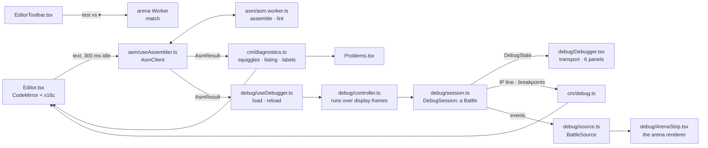

# Editor and debugger

[`apps/web`](../README.md) › Editor and debugger. Paths are relative to `apps/web`.

`/editor` is a new bot; `/editor/<id>` a bot of this browser; `/editor/roster-<slug>` a roster
bot, read-only, with `fork`. `/editor?b=…` (the arena's `open in debugger`) opens the setup's first
bot, `/editor#src=…` (the editor's `share`) opens a bot not saved yet, and `/editor?t=dwarf` starts a
new bot from a template. The code is in `src/features/editor/`; `EditorRoutes.tsx` turns the URL
into a document, and `EditorPage.tsx` (its `Workbench`) lays the page out and owns every action.

## Architecture

Two Workers and one main-thread battle. The assembler Worker turns the text into bytes; the
debugger runs its own `Battle` on the main thread, so a step stops between any two cycles; the
arena Worker plays `test vs` headless.

| Part | Where |
| --- | --- |
| Assemble on idle | `asm/useAssembler.ts` sends the source to `asm/asm.worker.ts` 300 ms after the last change (the first at once); only the answer to the last request counts. `asm/run.ts` assembles at the 4,096-byte cap (the top of super-heavy), lints, and measures a bot past the cap. `asm/client.ts` falls back to the main thread if the Worker fails. |
| Results in the editor | `cm/diagnostics.ts`: `showResult` hands a result whose source the editor still holds to `@codemirror/lint` (`setDiagnostics`: squiggles, tooltips with the fix, `lintGutter` marks) and to `setAssembled`. `problemsOf` reads the mapped findings back for `Problems.tsx`. |
| Listing gutter | `cm/listing.ts`: `0x000D  C7 05 00 00` per line from the last assemble without errors, mapped through edits until the next; `l` shows and hides it. |
| Toolbar | `EditorToolbar.tsx`: name, `%name`, size (warn from 90%, danger past the cap), assemble (Mod-Enter), format (Shift-Alt-f; `diff.ts` turns the formatter's text into small changes so the cursor stays in its token), lint, save (Mod-s), versions, share, `test vs ▾`, templates, listing. |
| New bot | `EmptyEditor.tsx`: while `/editor` holds the blank template as it comes, or no text, the templates sit over the editor, under the blank bot's lines. A template starts the bot from it (`?t=`, one edit that undo takes back); `blank` keeps the blank bot and selects its name; typing or `close` puts the panel away. |
| First visit | The kit's `CoachMark` under the debugger's run button: "assemble runs as you type; press F5 to debug". It goes for good on `got it` or on the debugger's first move (`useCoachMark('editor')`, `coachMarksSeen` in `store/settings.ts`). |
| Storage | Local bots in IndexedDB (`store/local-bots.ts`), the last 20 saves of each in their own database (`store/bot-versions.ts`); the switches, the recent list, and each unsaved text (a draft) in `localStorage` (`store.ts`). |
| `test vs ▾` | `test-vs.ts`: ten rounds of the duel against a roster bot in the arena Worker (`match`), shown as `W 7 · T 2 · L 1 vs imp`; `watch` opens `/arena` with the same bots and seed. |
| Debugger core | `debug/session.ts`: `DebugSession` runs a `Battle` on the main thread, a cycle at a time: step (one instruction of the followed process), step over (`call`, REP), step out, run to cursor, run until death, run N, and step back through the last 256 snapshots (a cycle at a time through a run). Each process's last 200 instructions (`debug/trace.ts`), register edits, and runs in parts (a budget of cycles) are the session's too. |
| Debugger page | `debug/useDebugger.ts` loads the editor's last assemble without errors with the opponents and seed (`?b=…&seed=…` start them), again by itself until the session moves, then on `reload`, carrying breakpoints by line (`debug/load.ts`). `debug/controller.ts` runs over display frames (8 ms of each, or the speed) and shows a run 10 times a second. |
| Debugger panels | `debug/Debugger.tsx`: the load bar, the transport, and Registers, Processes, Memory (`debug/memory.ts`: 32 rows swept from the listings' known starts), Watch, Breakpoints, and Trace (the CLI's trace format). `cm/debug.ts` puts the IP line and the breakpoint gutter in the editor. |
| Arena strip | `debug/ArenaStrip.tsx`: the arena's renderer on `debug/source.ts`, a `BattleSource` that taps the session's events with the arena Worker's frame builder (no Worker), locked on the followed IP; it folds with the kit's `SplitPane` (`collapsed`). |

The bot library (`Library.tsx`, `b`) lists recent documents, my bots, and the roster.

## AI mode

The `ai` panel (`ai/AiPanel.tsx`, its own chunk: the route is at its budget) is a chat beside the
source, and the default layout (`PRESETS.ai` in `layout/tree.ts`; `store.ts` version 3 moves a
kept layout that is still the old `writing` or phone default to the new one).

| Part | Where |
| --- | --- |
| The request | `ai/chat.ts`: `POST /api/ai/chat` with the turns (the newest 16 that say something), the editor's text, and the hill; the answer read as Server-Sent Events, one `AiEvent` (`@asmbots/protocol`'s `ai.ts`) each. |
| The server | `apps/api/src/routes/ai.ts`: the model, its two tools (`write_bot`, `read_bot`), the competitors block, and the caps. See the API's README. |
| Into the editor | A `source` event with bytes (`size > 0`) goes in at once through `replaceText`, one edit each; one with errors waits for the fix, and if no version assembles, the last goes in anyway. The toast's `undo` undoes every edit of the turn. |
| The hill | `hillOfSize`: the bot's weight class from the last assemble (`main` for a lightweight); the select's pick holds after that. |

## Keymap

The function keys go through one window listener (`debug/keys.ts`): they work in the editor and in
the panels' fields, and never reach the browser, where F5 reloads and F11 goes full screen. The
page keys are the app's keymap: a text field keeps them while it has the focus, and Esc leaves the
editor (a popup or the search panel closes first). `?` lists them all. Every key's words live in
`src/app/keymaps.ts`, which the hooks, the key help, and the docs' keyboard map all read.

| Key | Where | Does |
| --- | --- | --- |
| Mod-Enter | editor | assemble now |
| Shift-Alt-f | editor | format |
| F8 | editor | go to the next problem |
| Tab, Shift-Tab | editor | the next 8-column stop; one stop out |
| Ctrl-Space | editor | completion (CodeMirror's keys: search, undo, and the rest, work too) |
| Esc | editor | leave the editor |
| Mod-s | anywhere | save |
| F5, F6 | anywhere | run, pause |
| F9 | anywhere | set or clear the breakpoint on the cursor's line |
| F10, F11, Shift+F11 | anywhere | step over, step, step out |
| `space` | page | run or pause |
| `.`, `,` | page | step, step back |
| `[`, `]` | page | slower, faster runs |
| `0` | page | the strip's whole core |
| `b`, `l` | page | the bot library, the listing gutter |

## Breakpoints

A breakpoint is an address in the `DebugSession`, never an INT3 in the core. Before each cycle the
session reads the front process of each living bot, the one that runs in that cycle, and stops
when one stands on an enabled breakpoint whose condition holds (`check` in `debug/session.ts`). No
turn can change another bot's queue or registers before its own turn, so the check before the
cycle is exact. The core stays as the arena has it: an opponent can neither read a breakpoint nor
bomb it, and the debugger's battle is the arena's, cycle for cycle.

- **Setting one.** A press on the gutter left of the line numbers, F9 on the cursor's line, a press
  on a memory row, or an address or a label in the Breakpoints panel.
- **Lines and addresses.** Each line with bytes carries a marker from the loaded bot's listing
  (`cm/debug.ts`): the line's offset plus the bot's base, which the seed moves. The markers map
  through edits, so a line keeps its address until the next load, and a line typed since has none.
  A `reload` moves each breakpoint in the bot's bytes to its line's new address (`debug/load.ts`);
  one elsewhere in the core keeps its address.
- **Conditions.** `ax == 0x10 && cx < 3`, typed in the Breakpoints panel. `@asmbots/asm`'s
  `parseCondition` reads each side as the assembler reads an expression (number forms, operators,
  precedence) over the registers, their byte halves, `ip`, `flags`, and `cf pf af zf sf tf if df of`;
  `$` is the IP. Values wrap to 16 bits and compare unsigned. A condition that cannot be evaluated
  (a division by zero) stops the move and says why.
- **Hits.** Each breakpoint that holds before a cycle counts a hit; when two hold in the same cycle,
  the first in turn order is the stop. `reset` keeps the breakpoints and zeroes their hits.
- **Resuming.** A move never stops where it starts: `run` from a breakpoint runs the instruction
  there first, as a debugger resumes.
- **INT3.** ISA §3.6 makes INT3 a breakpoint in the debugger: the session stops before a process
  runs an INT3 its own bot owns, and the next move runs it, so the process dies as in the arena. An
  INT3 another bot wrote is a bomb, and kills without a stop.

## Adding a template

1. Write its source in `templates.ts` as a constant, in the formatter's layout, with `%name`,
   `%author`, and `%strategy`. A roster bot needs no copy: `templateSource` takes it from
   `rosterCatalog()`, as `imp` and `dwarf` do.
2. Add its id to `TEMPLATE_IDS` (lowercase letters: `?t=` takes `[a-z]{1,32}`), its entry to
   `TEMPLATES` (`label`, the menu's text; `detail`, the empty state's second column, 28 characters
   at most), and its case to `templateSource`.
3. The toolbar's templates menu, the new bot's empty state, and `/editor?t=<id>` pick it up.
4. Test: `test/editor-docs.test.ts` assembles every template (no error, no lint warning), checks
   that the formatter leaves it as it is and that its detail fits; add its label to that test's
   list and to the empty state's in `test/editor-page.test.tsx`.

A snippet that goes in at the cursor, such as the base idiom, is not a template: it is an entry of
`SNIPPETS` in `cm/complete.ts`, which completion and the menu's `base idiom` share.
